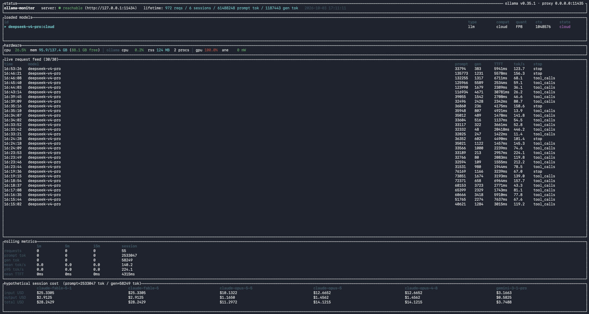

# Ollama-Monitor

A terminal dashboard for [Ollama](https://ollama.com) on macOS. It sits in front of your local Ollama as a transparent proxy and shows each chat and completion request's tokens, time to first token and throughput, what the same tokens would have cost on frontier APIs, and live Apple Silicon hardware telemetry.



## Features

- **Live request feed**: the latest completed requests (up to 30, as many as fit, newest first) with completion time, model, prompt and generated tokens, time to first token, tokens per second and stop reason. A `~` marks counts that had to be estimated (see [Capture accuracy](#capture-accuracy)).
- **Models**: every installed model, local and `:cloud`, with its type, format, quantization, context length and state, sorted loaded, then cloud, then not-loaded. The panel has room for three rows, so on a machine with many models the loaded ones come first. `▸` marks the model the last request went to.
- **Rolling metrics**: requests, tokens, mean and p95 tokens per second, and mean time to first token over the last 1, 5 and 15 minutes and the whole session.
- **Hypothetical cost**: your session's token counts priced at list rates for Claude Fable 5.1, Fable 5, Opus 5.5, Opus 5, Opus 4.8 and Gemini 3.1 Pro.
- **Hardware**: system CPU and memory, CPU and memory of Ollama's processes (the app, the server and its model runners), GPU active residency and Neural Engine power.
- **History**: lifetime request and token totals across sessions, kept in a local SQLite database.

## How it works

Ollama returns per-request stats (token counts, durations, stop reason) only in the response to the client that made the request; there's nothing a separate program can subscribe to. So Ollama-Monitor runs a reverse proxy in front of Ollama:

```
client ──▶ :11435 ollama-monitor ──▶ :11434 ollama
                  │ copies each response as it streams past
                  ▼
            parses the final stats ──▶ SQLite + dashboard
```

Point your clients at the proxy's port instead of Ollama's. Responses pass through unchanged. So do requests, with one exception: for OpenAI-compatible requests that don't set `stream: false`, the proxy adds `stream_options.include_usage: true` so that Ollama reports token counts. Clients ignore the extra final chunk this produces. Requests sent straight to Ollama's own port aren't seen.

It also polls Ollama's `/api/version`, `/api/tags` and `/api/ps` every 2 seconds for the model list. Hardware figures come from [`sysinfo`](https://crates.io/crates/sysinfo) and from macOS's `powermetrics`, which needs sudo.

**Privacy:** the database stores only per-request metadata (model, token counts, timings), never prompt or response text, and the monitor's log doesn't contain them either. The monitor talks only to the Ollama server you point it at; the cost figures come from a pricing table compiled into the binary.

**Security:** the proxy has no authentication of its own. It also sends its own `Host` header upstream, so Ollama's DNS-rebinding protection (while it listens on localhost, Ollama accepts only local host names) doesn't cover requests that come through the proxy. Ollama's `Origin` (CORS) check still applies.

## Requirements

- macOS. Apple Silicon is recommended: the GPU and Neural Engine figures come from `powermetrics`.
- Ollama running (the desktop app or `ollama serve`), by default on port 11434.
- Rust 1.94 or newer, to build.
- sudo, for the GPU and Neural Engine figures only.

## Install

Clone the repository, then from its directory:

```sh
cargo build --release          # binary at target/release/ollama-monitor
cargo install --path .         # or: put ollama-monitor on your PATH via ~/.cargo/bin
```

## Usage

```sh
ollama-monitor
```

Then point your clients at `http://127.0.0.1:11435` instead of Ollama's `:11434`:

```sh
curl http://localhost:11435/api/chat -d '{"model": "qwen3:14b", "messages": [{"role": "user", "content": "hi"}]}'
```

At launch it asks for your sudo password, used only to start `powermetrics` for the GPU and Neural Engine figures. Run it as your normal user, not under `sudo`, so the proxy never runs as root. If sudo fails, those two figures show `n/a` and everything else still works. If the proxy's address is taken or malformed, it exits straight away with the error, before asking for the password.

`--no-tui` runs headless instead: one summary line per request on stderr (alongside the log's info lines), still recorded to the database. Headless mode never prompts for sudo and skips the hardware and model polling.

To let other machines or VMs use the proxy, bind it to all interfaces with `--proxy-listen 0.0.0.0:11435`. The proxy has no authentication of its own, so this exposes your Ollama to that network, just as `OLLAMA_HOST=0.0.0.0` would.

To capture clients you can't reconfigure, move Ollama to another port and give its usual port to the proxy:

```sh
OLLAMA_HOST=127.0.0.1:11400 ollama serve
ollama-monitor --proxy-listen 127.0.0.1:11434 --ollama-url http://127.0.0.1:11400
```

Everything that talks to `:11434` then goes through the proxy, the `ollama` CLI included. Uploads such as `ollama create` from a local model file stream straight through to Ollama.

### Flags

| flag | default | purpose |
|---|---|---|
| `--proxy-listen <ADDR>` | `127.0.0.1:11435` | where the proxy listens: an IP and port (`[::1]:11435` for IPv6), not a host name |
| `--ollama-url <URL>` | `http://127.0.0.1:11434` (env `OLLAMA_URL`) | upstream Ollama; Ollama's own `OLLAMA_HOST` isn't read |
| `--config <PATH>` | `~/Library/Application Support/ollama-monitor/config.toml` | optional config file |
| `--db <PATH>` | `~/Library/Application Support/ollama-monitor/usage.db` | SQLite database |
| `--no-tui` | off | headless mode |

### Keys

| key | action |
|---|---|
| `q` or `Ctrl-C` | quit |
| `r` | reset the session: clear the feed, rolling metrics and cost (the database keeps everything) |
| `p` | pause the feed, rolling metrics, cost and `▸` marker. Requests that arrive while paused are still saved and counted in the lifetime totals, but never enter those panels, even after you resume. The header, models and hardware keep updating |

## Capture accuracy

| request type | what's measured |
|---|---|
| Ollama native (`/api/chat`, `/api/generate`), streaming or not | exact: token counts and durations come from Ollama itself. Time to first token is Ollama's model-load plus prompt-processing time, so it leaves out time spent queued |
| OpenAI-compatible streaming (`/v1/chat/completions`, `/v1/completions`) | exact token counts; timings measured at the proxy |
| OpenAI-compatible, non-streaming | exact token counts. Tokens per second is end to end (it includes prompt processing), so it understates decode speed, and time to first token shows 0, which pulls the mean down |
| OpenAI-compatible streams that end without a usage chunk: `:cloud` models when Ollama's cloud relay drops it ([ollama/ollama#15169](https://github.com/ollama/ollama/issues/15169)), or a stream cut off early | estimated, marked with `~`: generated tokens are counted from streamed chunks and prompt tokens show as 0, so the cost panel undercounts them. A cut-off stream's stop reason shows `unknown` |

Not recorded: Ollama-native streams that end before their final stats line (when the client disconnects mid-answer, for example), model load and unload calls (an empty prompt or `keep_alive: 0`, like the preload `ollama run` sends), and every other endpoint (embeddings, model management), which simply passes through. A tracked request that ends without usable stats is noted in the log as `no parsable stats in response`.

## Configuration

Prices live in [`pricing.toml`](pricing.toml) and are compiled in. To change one, add an override to `~/Library/Application Support/ollama-monitor/config.toml`. For example, to price Gemini at its rate for prompts over 200K tokens:

```toml
[pricing.providers.google.models.gemini-3-1-pro]
input_per_mtok_usd  = 4.00
output_per_mtok_usd = 18.00
```

Overrides are matched by model key; the provider name only groups them. Each entry needs both rates, and if any entry is malformed the whole override table is ignored, with a warning in the log. Only the six models above have a column, so other keys have no effect. A config file that isn't valid TOML stops startup with the parse error.

The cost panel is a rough comparison, not a quote. It applies list prices to your local model's token counts (a frontier model would tokenize the same text differently), and it ignores prompt caching, batch discounts and long-context pricing tiers.

## Files

| file | location |
|---|---|
| database | `~/Library/Application Support/ollama-monitor/usage.db` |
| log | `~/Library/Application Support/ollama-monitor/ollama-monitor.log` |
| config (optional) | `~/Library/Application Support/ollama-monitor/config.toml` |

The log stays there whatever `--db` and `--config` say. It's appended to and never rotated, so clear it out now and then while the monitor isn't running. Set `OLLAMA_MONITOR_LOG=ollama_monitor=debug` (or `=trace`) for more detail from the monitor itself; `trace` includes the raw `powermetrics` output. A bare `debug` or `trace` also turns on the HTTP libraries' logging, which is noisy.

The database is plain SQLite; [ARCHITECTURE.md](ARCHITECTURE.md#persistence) describes the schema. For example, lifetime totals per model:

```sh
sqlite3 ~/Library/Application\ Support/ollama-monitor/usage.db \
  "SELECT model_id, COUNT(*), SUM(prompt_tokens), SUM(gen_tokens) FROM inference_records GROUP BY model_id"
```

## Troubleshooting

| symptom | check |
|---|---|
| exits at startup with `bind …: Address already in use` | Something else, often another ollama-monitor, holds the proxy port. Stop it or pick another `--proxy-listen`. |
| exits with `invalid --proxy-listen value` | Give an IP and port such as `127.0.0.1:11435`; host names like `localhost` aren't accepted. |
| header shows `server: ● unreachable` | Is Ollama running (`curl http://localhost:11434/api/version`)? The `err:` text after the status names the call that failed. |
| no requests appear | Clients are probably still talking to `:11434`; `curl http://localhost:11435/api/version` should answer through the proxy. Also check the header for `[PAUSED]`, and that the client uses an endpoint that's [recorded](#capture-accuracy). |
| "Permission denied" on the log or database at startup | An earlier run under `sudo` left root-owned files: `sudo chown -R "$USER":staff ~/Library/Application\ Support/ollama-monitor`. |
| GPU or ANE shows `n/a` | Expected for the first couple of seconds. After that, the log says `powermetrics exited` if sudo wasn't available or powermetrics failed; run with `OLLAMA_MONITOR_LOG=ollama_monitor=trace` to see its raw output. |
| sudo prompt fails | Run `sudo -v` first, or use `--no-tui`. |

## Development

```sh
cargo test
cargo fmt --all --check && cargo clippy --all-targets --locked -- -D warnings
cargo test screen_snapshot -- --nocapture         # print the dashboard at 120x36 and 160x44 from fixtures
cargo test live_ollama -- --ignored --nocapture   # render the dashboard with your local Ollama's models (read-only)
cargo test live_sysinfo -- --ignored --nocapture  # print one real CPU, memory and process sample (no sudo)
```

GitLab CI ([`.gitlab-ci.yml`](.gitlab-ci.yml)) runs the same checks on Linux. [ARCHITECTURE.md](ARCHITECTURE.md) covers the module layout, data flow and design decisions.

Ollama-Monitor shares its dashboard with [LMS-Monitor](https://github.com/Ward-Software-Defined-Systems/LMS-Monitor), a sibling project for LM Studio.

## License

MIT, see [LICENSE](LICENSE).

Ollama-Monitor is an independent project, not affiliated with or endorsed by Ollama, Anthropic or Google.
